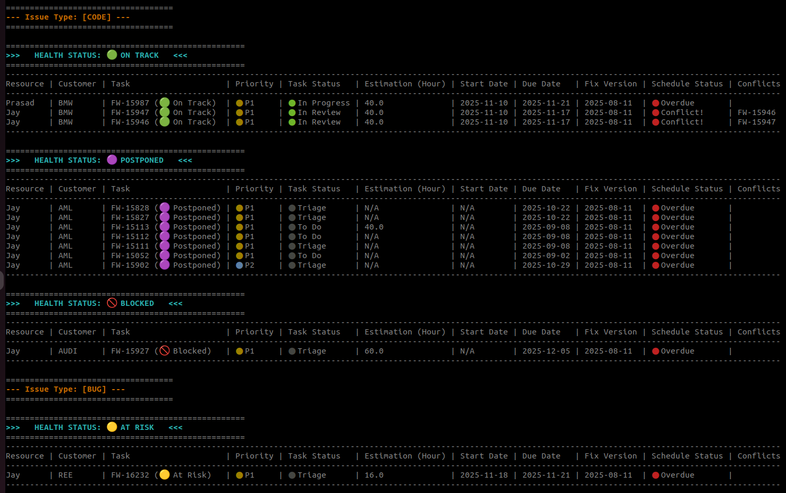

# Jira Multiple Project Planner

A command-line tool to fetch Jira issues across multiple projects, generate a consolidated plan, and display a timeline-style overview directly in the terminal.

## Output Screenshot




---

## Features

* Fetch Jira issues from **multiple projects** using JQL.
* Combine and generate a unified **project planning view**.
* Provide **timeline-style visualization** in CLI.
* Uses environment variables for secure authentication.
* Lightweight Python-based tool suitable for automation and scripting.

---

## Requirements

* Python 3.8 or higher
* Jira account access with API token
* Environment variables:

  * `JIRA_EMAIL`
  * `JIRA_API_KEY`

---

## Setup

### 1. Clone the Repository

```bash
git clone <your-repository-url>
cd <your-project-folder>
```

### 2. Install Dependencies

```bash
pip install -r requirements.txt
```

---

## Environment Variables

Before running the tool, export your Jira credentials:

```bash
export JIRA_EMAIL="your-email@example.com"
export JIRA_API_KEY="your-api-token"
```

These are required for authenticating requests to the Jira API.

---

## Usage

### Fetch Jira Issues

```bash
python fetch_jira_issues.py
```

This loads all required issues based on the JQL definitions inside `config/jql_query.txt`.

---

### Generate Planner Timeline View

```bash
python main.py
```

This runs the full planning flow:

* Loads config from `config/planner_config.json`
* Processes issue details
* Outputs CLI-based timeline and consolidated plan

---

## Project Structure

```
├── config
│   ├── jql_query.txt
│   ├── planner_config.json
│   └── README.md
├── fetch_jira_issues.py
├── main.py
├── planner.py
└── __pycache__
```

---

## Configuration

### `config/jql_query.txt`

Contains one or more JQL queries for fetching issues from multiple Jira projects.

### `config/planner_config.json`

Controls how planner timelines and project structures are generated.

---

## Output

All results are displayed **directly in the terminal**, including:

* Grouped issues by project
* Timeline-style layout
* Status summary and planning view

---

## Authentication & Security

* API credentials are **not stored** in the project.
* Authentication uses environment variables only.

---

## Contributions

Contributions, suggestions, and improvements are welcome.

---
